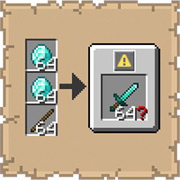

# Total Craft Count

  

   
A lightweight mod that displays the total possible items you can craft next to the grid.

## Functionality

  

   
- **Total Count Preview**: Adds a small preview container beside the crafting grid in both the Player Inventory (2×2) and the Crafting Table (3×3).
- **Smart Display**: When your ingredients cover more than one batch, the container appears and shows the output item alongside the total number of that item you would get from a shift-click, not just the per-craft output.
- **Clean UI**: If your ingredients only cover a single batch, the container stays hidden and the UI remains uncluttered.

> **Limitation:** Modded recipes that consume more than one item from a single slot in a single craft may display an inflated total.

## Benefits

  

   
- Shift-clicking a crafting result consumes all of your ingredients at once. This mod tells you exactly how much that is before you click.
- Prevents accidentally crafting far more of something than you intended, wasting materials or flooding your inventory.
- Information is surfaced at a glance, right next to the grid, with no extra steps.

## Installation

  

   
1.  **Requirements**: Ensure you have Minecraft 1.21.10, Fabric Loader 0.18.4, and the Fabric API installed.
2.  **Download**: Get the latest `.jar` from [Modrinth](https://modrinth.com/mod/total-craft-count) or [CurseForge](https://www.curseforge.com/minecraft/mc-mods/total-craft-count).
3.  **Setup**: Drop the file into your `%appdata%/.minecraft/mods` folder.

## Support

  

   
If you encounter bugs or wish to contribute:
* [Report any problems you find.](https://github.com/armaninyow/Total-Craft-Count/discussions/categories/issues)
* [Share your ideas for new features.](https://github.com/armaninyow/Total-Craft-Count/discussions/categories/suggestions)

## Credits

  

   
* **Author**: Armaninyow
* **License**: Released under [CC0-1.0](https://creativecommons.org/publicdomain/zero/1.0/).

